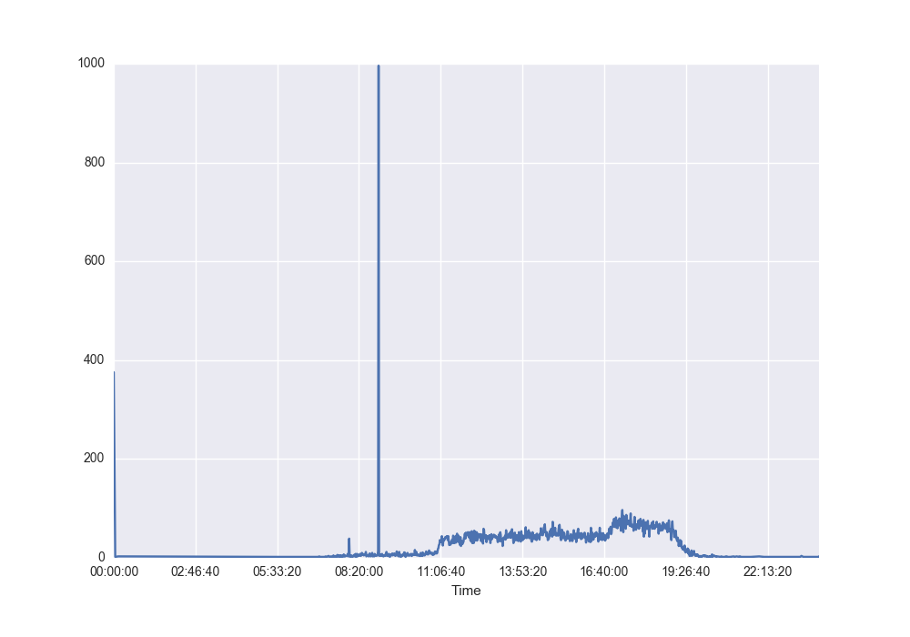
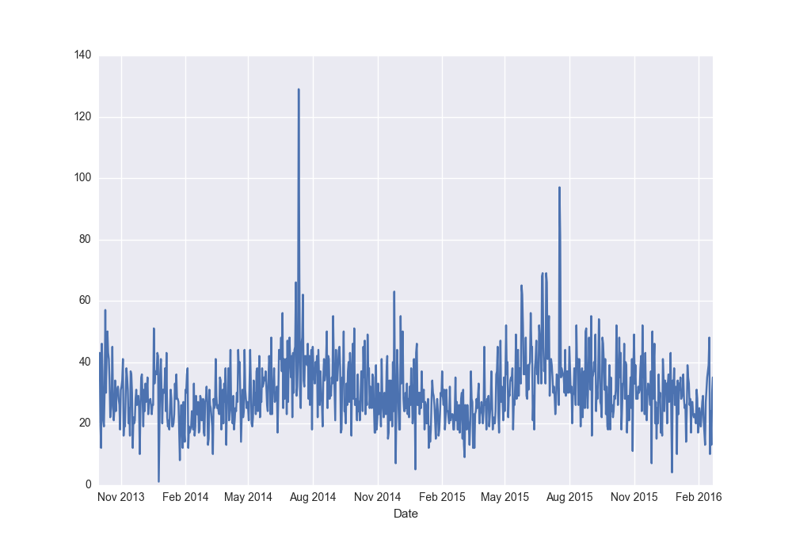
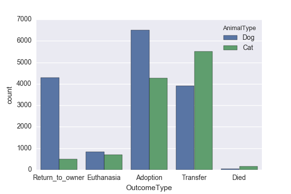
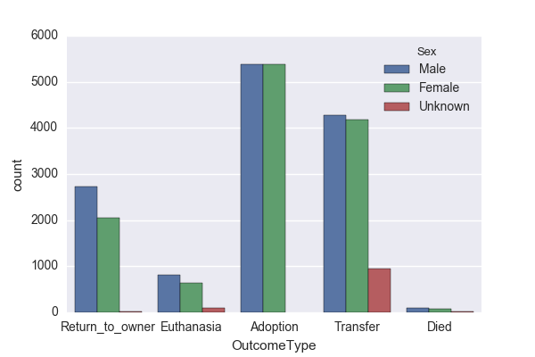
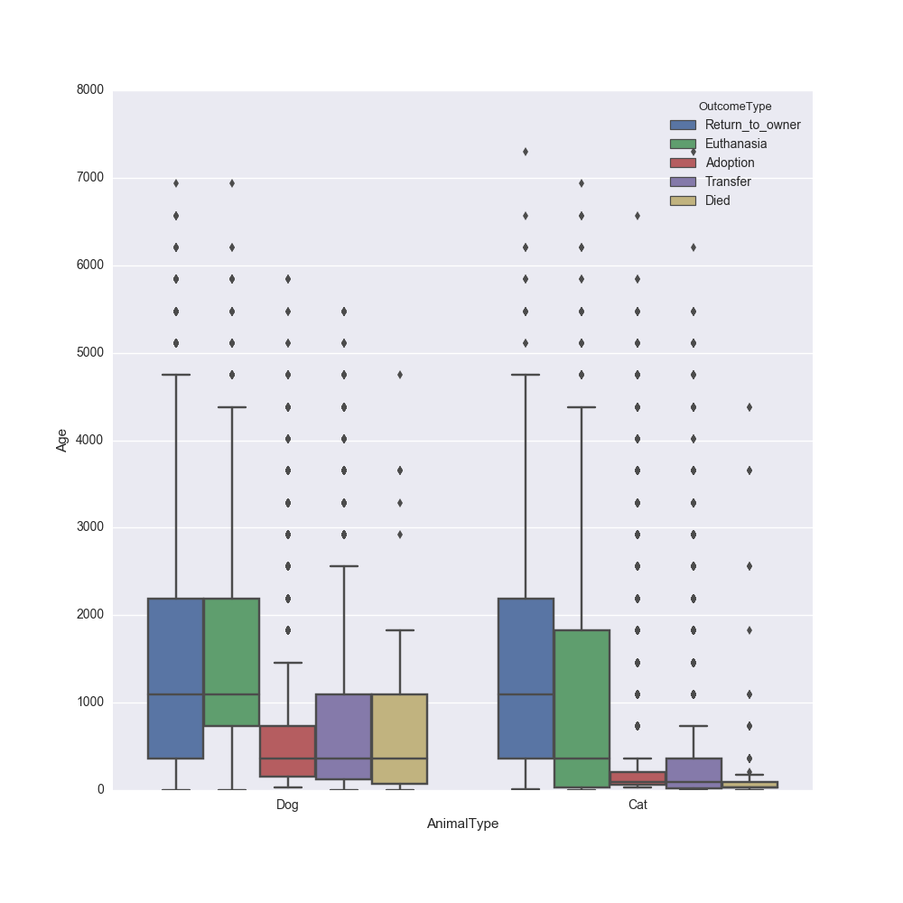
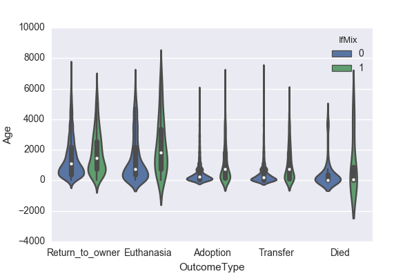
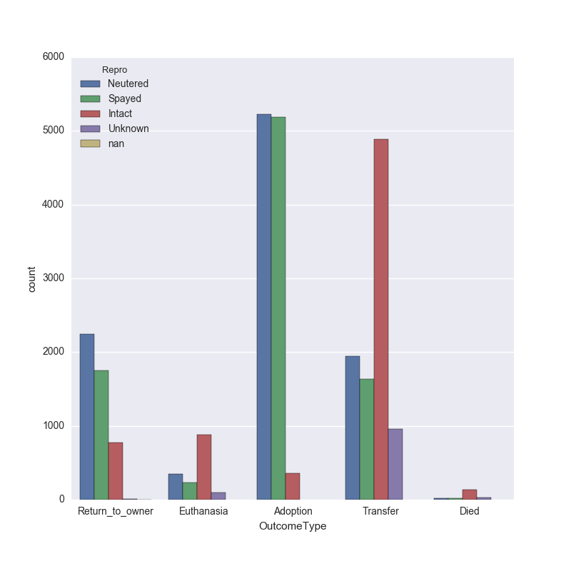
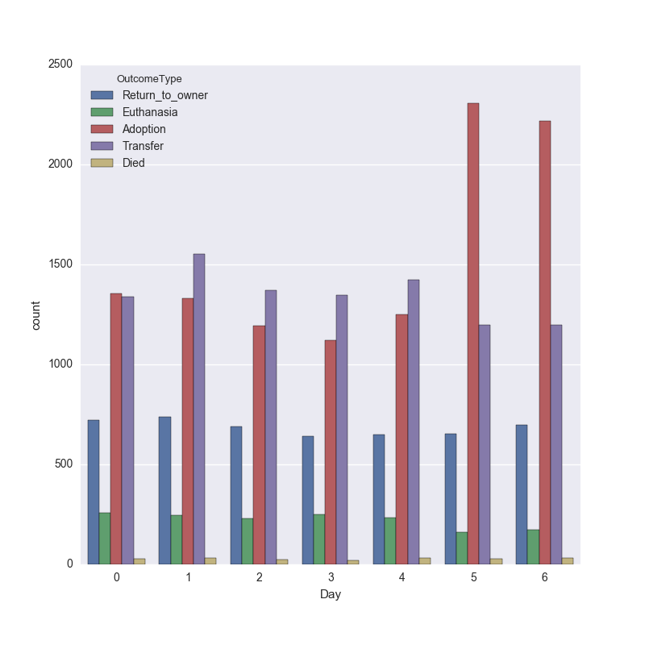
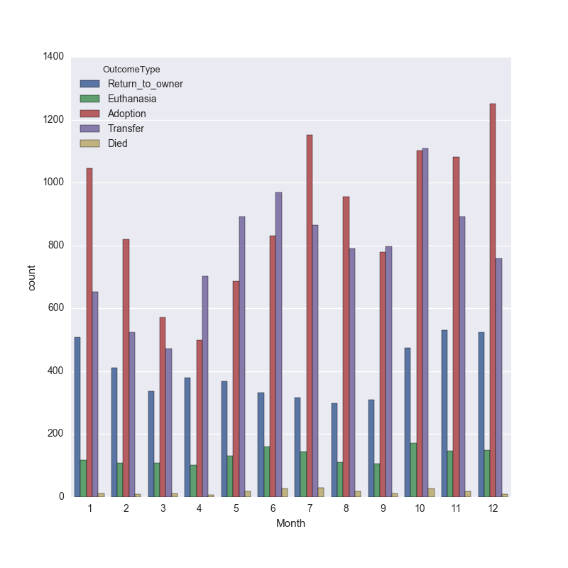
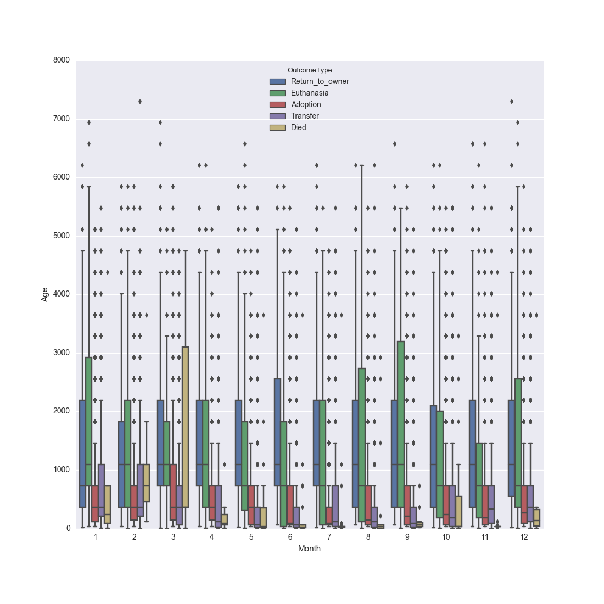

# Capstone Project
## Machine Learning Engineer Nanodegree
Gauri Phatak
January 2017

## I. Definition

### Project Overview

In this project I will be using the Austin Animal shelter data provided by Austin Animal Center to predict the outcomes for shelter animals. This data is part of a completed competition on Kaggle website. Based on the sources cited in the references section, 8-12 million animals enter shelters every year and about 5-9 milllion of those animals are euthanised. In this project we will be exploring the data provided to understand the trends behind the animal adoptions for the city of Austin. We will be starting of with Exploratory Data Analysis, both visual and statistical data. Once we get an idea about the correlations in the data, we will use classification methods to predict if the animal will adopted or not. This is a multiclass classification problem, and we will get the benchmark for the analysis comparison form the outcomes of the data science competition on kaggle.

### Problem Statement

The goal is to predict the outcome for an animal which enters the animal Shelter.
    - Download the data from Kaggle website.
    - Preprocess the data columns as explained in the exploratory data analysis.
    - Run the benchmark DecisionTree algorithm. Gather the probability of the outcome 
    - Run the RandomForest algorithm on the data.
    - Run GridsearchCV algorithm to tune the data.
    - Compare the output from the different algorithms and complete analysis.
    
The Output of the algorithm will give us the probability of outcome for each output category.

### Metrics

The test data that is provided by the kaggle team does not provide the output vector. Hence, evaluation is possible only in the kaggle environment. I will be using the predict_prob_ function from randomForest algorithm from sklearn, that gives the probability for each factor in the outcometype column. 

## II. Analysis

### Data Exploration

The data form the Animal Shelter Outcome competition in kaggle is one csv file of training data and one file of testing data. 
Here is a short explanation of the features and its dtype provided to us:

AnimalID          object : Unique ID provided to each animal.
Name              object : Name given to the animal. Some fields are left blank, possibly because the animal might not have a tag at time of admission.
DateTime          object : Date and time at the time of outcome
OutcomeType       object : This is the outcome we are expecting for each animal. We have 5 categories for this data
OutcomeSubtype    object : This is a peripheral outcome for the anima. Some of the entries provide reason for the outcometype. 
AnimalType        object : Animal type is the type of animal. In this case either a cat or a dog.
SexuponOutcome    object : This features tells us if the animal is Male or Female and intact or spyaed/neutered.
AgeuponOutcome    object : This give the age of the animal upon outcome.
Breed             object : This gives the breed of the animal and tells us if they are mixed breed or not.
Color             object : This feature gives the prominent colors found in the animal.

In the test data we do not have OutcomeType and OutcomeSubtype column. The scoring comparison can be done onyl directly with the kaggle submissions page. The AnimalID column is given as ID column in test data. some of the data entries for the columns above is blank. This might be due to data entry error or lack of information. We will take a look into this further in the data pre processing section. 

### Exploratory Visualization
In this section, you will need to provide some form of visualization that summarizes or extracts a relevant characteristic or feature about the data. The visualization should adequately support the data being used. Discuss why this visualization was chosen and how it is relevant. Questions to ask yourself when writing this section:
- _Have you visualized a relevant characteristic or feature about the dataset or input data?_
- _Is the visualization thoroughly analyzed and discussed?_
- _If a plot is provided, are the axes, title, and datum clearly defined?_

The plots below give relation between different feature and the outcome for each animal. We will also take a look multivariate plots.

The plot below shows the time count for the given data. We can see that most of the entries we observe are taking place between 11 am and 7.30 p.m. this would make sense since the shelter is open from 11 a.m. till 7 p.m. We do see one anomaly in the data which shows the count for about 8.30 shoot up really high.  

We will see in further plots where this anomaly lies. 

Next we take a look at the data trends over Date. We can see a sinosoidal pattern here. We see that more animals are processed through the shelter during the summer months than during the winter months. We will see further how they are divided for diffrent outcome types.

In the plot above we see that most of the animals both cats and dogs are adopted out or transfered. A lot more dogs are returned to owners. than cats. They have not specified if the return to owner features means if the animal was lost it is returned or if the animal does not get adopted after surrender it is not returned. We can see that the number of cats dying is dlightly higher than dogs dying. and the number of dogs euthanised is slightly higher than cats euthanised. the number of transfers for cats is higher than Dogs.

In the plot above we can see the gender distribution of the animals according to the outcome type. We can see that most of the animals who get adopted are either male or female. We have an unknwon category where we do not know the gender of the animal upon outcome, this can be a clerical error. We can see that we know the gender of all the animals that are adopted. 

We can see this distribution of cats and dogs over the major age brackets in the box plot above. We can see that most of the adoption that happen for both cats and dogs happen for lower age group of animals. Interestingly most of the cats that get euthanised spread over a wide range of age. and most of the cats that died in the shelter are very young. This might be because the animal is sick to begin with.

In the violin plot above we can see the distribution of animals based on if they are mixed breed or not, with the age of the animal over y axis. We can see that most of the adoption happen at lower age for both mix and purebred aniamls. while most of the animals euthanised are spread over lower age groups if they are mix brreds and the have a more even spread if they are purebred animals. 

Here we see the distribution of number of aniamsl based on if they were intact or not at the time of outcome. Most of the animals that get Adopted are spayed or neutered. We can see most of the animals that get transfered are intact. We can see that a lot many animals that are euthanised or die in care are intact. Many shelter has a rule where upon adoption the animals has to be fixed. This plot might be an indication of that rule. Very few animals that get adopted are infact intact. 

We will now see some time based outcome plots. We will see the distribution of outcomes over the day of the week, month and time of day. 

We can see in the plots above the patterns for outcomes over different time metrics. In the first plot we can see that most of the adoptions happen during Afternoon and evening. Most of the transfers happen during Afternoon. Most of the return to owner  happen during afternoon and evening. 

In the 2nd plot the Day of the week start from Monday denoting 0 and Saturday and sunday denoted by 5 and 6. We can see that most adoptions happen during the weekend i.e. Saturday and Sunday. This makes sense, since most people would be free during the weekends to come out to checkout animals for adoption.

When we look at the distribution over the months we can see the sinosoidal distribution that we saw in the 2nd plot in this section. 

In this plot we see the boxplot for distribution of outcome over the months. We have he age distribution along the y axis. 

### Algorithms and Techniques

Given than the target variable for our data is categorical value, I will be using classification method for this project. I will be starting off with decision tree algorithm to get an idea of what the score would be with just a single tree implementation. then i move on to RandomForest algorithm. 

The deicision tree algorithm would be the benchmakr for my code. But the Kaggle competition has provided with a built in benchmark value for this particular competition. 

Random forest classifier is a ensemble method where in the algorithm creats number of decision trees based on the data provided tot he algorithm. The issue with decision tree classifier is that it overfits the data. Random forest avoids such an issue becuase it uses multiple trees. The data selected for each tree is gathered by using bootstrap aggregation method or bagging. Bagging randomly chooses a subset of data form the training data with replacement and creates decision tree based on this data.
After training, for prediction decision is made by taking majority vote from the decision trees that are generated during training. One thing to note with random forest algorithm is that it uses modified tree learning algorithm, this means that if a particular features is a strong predictor, these features will be selected in many of the trees giving strong correleation between the trees thus created.
In egenral case if the problem is that of classification, Sqrt(p) features will be used for creating the trees, p is the number of available features.

The dataset that I am working with here is a good candidate for random forest algorithm. The issue of voerfitting which we observe in decision trees is not present in random forest. We dont have to worry about tuning the data too much for random forest algorithm. It is fast and scalable. But if we have to rebuild the tree if new data comes into picture. But since that is not a point of contention for us I am going to go ahead with Random Forest as the classification algorithm.

### Benchmark

Evaluation (Directly from Kaggle)

Submissions are evaluated using the multi-class logarithmic loss. Each incident has been labeled with one true class. For each animal, you must submit a set of predicted probabilities (one for every class). The formula is then,

logloss=−1N∑i=1N∑j=1Myijlog(pij),
logloss=−1N∑i=1N∑j=1Myijlog⁡(pij),
where N is the number of animals in the test set, M is the number of outcomes, \\(log\\) is the natural logarithm, \\(y_{ij}\\) is 1 if observation \\(i\\) is in outcome \\(j\\) and 0 otherwise, and \\(p_{ij}\\) is the predicted probability that observation \\(i\\) belongs to outcome \\(j\\).

The submitted probabilities for a given animal are not required to sum to one because they are rescaled prior to being scored (each row is divided by the row sum). In order to avoid the extremes of the log function, predicted probabilities are replaced with \\(max(min(p,1-10^{-15}),10^{-15})\\).

[Link to Kaggle competition](https://www.kaggle.com/c/shelter-animal-outcomes).
In the [Leaderboard](https://www.kaggle.com/c/shelter-animal-outcomes/leaderboard) page in the link to the competition above we can see that Kaggle has created an All Adopted Benchmark. I will be using this benchmark for project purpose. But as a personal challenge i will be suing the decision tree algorithm for my benchmark, And aim for a score lower than the deiciosn tree algorithm would provide. The reasonf or this is that i can run Decision tree on the data frame I have created  for both the algorithms and do an apples to apples comparison.

## III. Methodology

### Data Preprocessing
In this section, all of your preprocessing steps will need to be clearly documented, if any were necessary. From the previous section, any of the abnormalities or characteristics that you identified about the dataset will be addressed and corrected here. Questions to ask yourself when writing this section:
- _If the algorithms chosen require preprocessing steps like feature selection or feature transformations, have they been properly documented?_
- _Based on the **Data Exploration** section, if there were abnormalities or characteristics that needed to be addressed, have they been properly corrected?_
- _If no preprocessing is needed, has it been made clear why?_

The underlying problem we are trying to solve in simplistic terms is to, predict the outcome for an animal based on the features and data entries provided to us from the Austin animal center. 
Here is the summary of the data we are dealing with:

      AnimalID   Name             DateTime OutcomeType OutcomeSubtype  \
count     26729  19038                26729       26729          13117   
unique    26729   6374                22918           5             16   
top     A705677    Max  2015-08-11 00:00:00    Adoption        Partner   
freq          1    136                   19       10769           7816   

       AnimalType SexuponOutcome AgeuponOutcome                   Breed  \
count       26729          26728          26711                   26729   
unique          2              5             44                    1380   
top           Dog  Neutered Male         1 year  Domestic Shorthair Mix   
freq        15595           9779           3969                    8810   

              Color  
count         26729  
unique          366  
top     Black/White  
freq           2824  

As we can see in summary of the data below, most of the data we are dealing with is categorical data. The size of the data frame is 26729 extries of data. Here is a sample of the head of the dataframe. I used Pandas to download the training and testing data from CSV file and create a pandas dataframe using this data.
**Add the head of dataframe here***

I will modifying almost every columns of data avaiable to us to check if get any additional importtant information out of it. 

**AnimalID: **Looking at the AnimalID column , I figured the the first three characters of the ID are repeating for many or the IDs, Hence I thought it might give us some location information in the data. But looking at the data from the testing data, It looks like the same pattern is followed with the testing data animal IDs. hence this column becomes useless to us for all practical purposes.

**Name: ** The name itself of an animal is not of important to us. but it might be important to note that having a name or not might influence the outcome for the animal.

**DateTime: ** This is a very interesting column which gives us a lot of information. This column gives us the data and time information at the time of the outcome. Using this column we can extract the weekday, month and time of the day the outcome occured. We will see in the data exploration and visualisation section how the outcome corresponds to the time , day and month of the outcome.

**OutcomeType: ** This is the target variable i.e. the variable we are trying to predict. We have 5 categories for prediction.

**OutcomeSubtype: ** This column gives information about the reasons for the outcometype for some of the entries. I had intended to use this since it seems to be givning information about why the decision for the outcomes are taken, but in the kaggle test data we can see that they have not provided this column. Hence, i will not be taking this column into consideration for the purpose of this report.

**AnimalType :** We have two unique animal types in this dataset. The animals caneither be dogs or cats. We will not be making any changes to this column.

**SexUponOutcome: ** Sexupon outcome column gives us the gender of each individual animal. IT also gives us information if the animal is nutered/spyaed or intact. We have 5 categories here. It seems to be that there is a lot of information compacted into one column here. I decided to split this column into the gender or the animal and if they are intact or not. There are entries where this information is unknown, I have just left those entries as unknown.

**AgeUponOutcome: ** Age upon outcome gives us the information about that particular animal. This column gives string information about the age of the animal is weeks, months or years. I have converted the entries into the age of animal is days. for e.g. if the entry says the age of an animal is '5 months' I multiple 5 by 30 to get the approximate age of the animal. This method has its flaws since we would not know the exact age of the animals. But we can get a good approximation.

**Breed: ** This column gives information about the breed of the animals. We also get information if the animal is mix breed or not. I have split this column to give two columns with more concise breed information. the first column tells us if the animal is mix breed or pure bred. The other column takes into account only the first mentioned column in case if the two breeds are seperated by a '/'.

**Color: ** This column gives the color information about the breed of the animal. If the data gives multiple colors for each animal, I choose only the first color. This reduces the number of factors we have to take into consideration. 

This will give us the various columns we can work with. I have used random forest algorithm to model the data and the decision tree algorithm as the benchmark for the data. The kaggle competition this project is based on evaluates the data using log_loss  method. And the benchmark score that they have used for the competition is **20.25113**. I will be considering this as the benchmark for the project. But as a personal benchmark to do better than would be the decision tree algorithm using the data the I have molded. 

Once I have created the various new columns with the relevant data i visualize them to get a good idea about the trends i can observe. We can see those visualisations in the exploratory visualisation section below. Once we get an idea of which columns might have a higher weight towards the decision. We can see the corelation values for this data in the Data exploration segment. For calculating corelation between the variables I am going to use Spearmans Rho or Kendalls Tau since Pearsons Rho needs calculation of mean for calculating the corelation. We use the pandas corr function indicating the type of correlation. 

To set the bench mark i first strat with the decisiontree algorithm from sklearn library. Then move onto the rnaodm forest algorithm form sklearn library as well. to get the best parameters for the algorithm i ran the gridsearchCV algorithm with the grid param as given below:
param_grid = {"max_depth": [1,3,6,10],
              "max_features": range(1,10,1),
              "min_samples_split": range(2,10,1),
              "min_samples_leaf": range(1,10,1),
              "bootstrap": [True, False],
              "criterion": ["gini", "entropy"]}
What this function does is, it takes the initialised ML algorithm , which in our case is the random forest algorithm and runs combinations for the grid parameters given above. The thing to note about grid searchCV is that it does not fit over all the parameters, it fits over parameters selectively, depending on if the parameter would generate a good result.
In my case with the above parameters it took a very long time for the gridsearch algorithm to run.

### Implementation
In this section, the process for which metrics, algorithms, and techniques that you implemented for the given data will need to be clearly documented. It should be abundantly clear how the implementation was carried out, and discussion should be made regarding any complications that occurred during this process. Questions to ask yourself when writing this section:
- _Is it made clear how the algorithms and techniques were implemented with the given datasets or input data?_
- _Were there any complications with the original metrics or techniques that required changing prior to acquiring a solution?_
- _Was there any part of the coding process (e.g., writing complicated functions) that should be documented?_

### Refinement
In this section, you will need to discuss the process of improvement you made upon the algorithms and techniques you used in your implementation. For example, adjusting parameters for certain models to acquire improved solutions would fall under the refinement category. Your initial and final solutions should be reported, as well as any significant intermediate results as necessary. Questions to ask yourself when writing this section:
- _Has an initial solution been found and clearly reported?_
- _Is the process of improvement clearly documented, such as what techniques were used?_
- _Are intermediate and final solutions clearly reported as the process is improved?_

## IV. Results
_(approx. 2-3 pages)_

### Model Evaluation and Validation
In this section, the final model and any supporting qualities should be evaluated in detail. It should be clear how the final model was derived and why this model was chosen. In addition, some type of analysis should be used to validate the robustness of this model and its solution, such as manipulating the input data or environment to see how the model’s solution is affected (this is called sensitivity analysis). Questions to ask yourself when writing this section:
- _Is the final model reasonable and aligning with solution expectations? Are the final parameters of the model appropriate?_
- _Has the final model been tested with various inputs to evaluate whether the model generalizes well to unseen data?_
- _Is the model robust enough for the problem? Do small perturbations (changes) in training data or the input space greatly affect the results?_
- _Can results found from the model be trusted?_

### Justification
In this section, your model’s final solution and its results should be compared to the benchmark you established earlier in the project using some type of statistical analysis. You should also justify whether these results and the solution are significant enough to have solved the problem posed in the project. Questions to ask yourself when writing this section:
- _Are the final results found stronger than the benchmark result reported earlier?_
- _Have you thoroughly analyzed and discussed the final solution?_
- _Is the final solution significant enough to have solved the problem?_

## V. Conclusion
_(approx. 1-2 pages)_

### Free-Form Visualization
In this section, you will need to provide some form of visualization that emphasizes an important quality about the project. It is much more free-form, but should reasonably support a significant result or characteristic about the problem that you want to discuss. Questions to ask yourself when writing this section:
- _Have you visualized a relevant or important quality about the problem, dataset, input data, or results?_
- _Is the visualization thoroughly analyzed and discussed?_
- _If a plot is provided, are the axes, title, and datum clearly defined?_

### Reflection
In this section, you will summarize the entire end-to-end problem solution and discuss one or two particular aspects of the project you found interesting or difficult. You are expected to reflect on the project as a whole to show that you have a firm understanding of the entire process employed in your work. Questions to ask yourself when writing this section:
- _Have you thoroughly summarized the entire process you used for this project?_
- _Were there any interesting aspects of the project?_
- _Were there any difficult aspects of the project?_
- _Does the final model and solution fit your expectations for the problem, and should it be used in a general setting to solve these types of problems?_

### Improvement
In this section, you will need to provide discussion as to how one aspect of the implementation you designed could be improved. As an example, consider ways your implementation can be made more general, and what would need to be modified. You do not need to make this improvement, but the potential solutions resulting from these changes are considered and compared/contrasted to your current solution. Questions to ask yourself when writing this section:
- _Are there further improvements that could be made on the algorithms or techniques you used in this project?_
- _Were there algorithms or techniques you researched that you did not know how to implement, but would consider using if you knew how?_
- _If you used your final solution as the new benchmark, do you think an even better solution exists?_

-----------

**Before submitting, ask yourself. . .**

- Does the project report you’ve written follow a well-organized structure similar to that of the project template?
- Is each section (particularly **Analysis** and **Methodology**) written in a clear, concise and specific fashion? Are there any ambiguous terms or phrases that need clarification?
- Would the intended audience of your project be able to understand your analysis, methods, and results?
- Have you properly proof-read your project report to assure there are minimal grammatical and spelling mistakes?
- Are all the resources used for this project correctly cited and referenced?
- Is the code that implements your solution easily readable and properly commented?
- Does the code execute without error and produce results similar to those reported?
